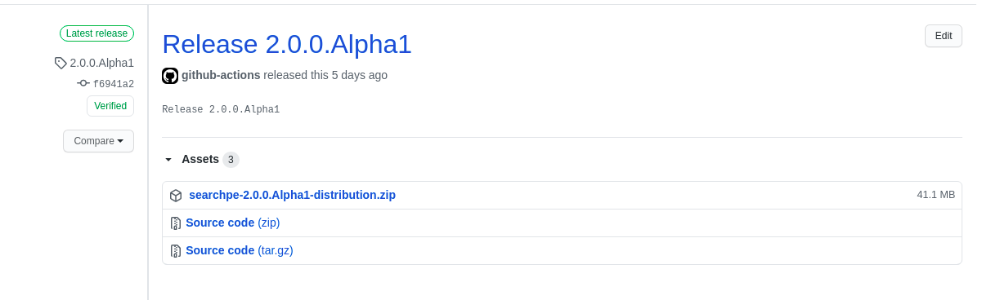
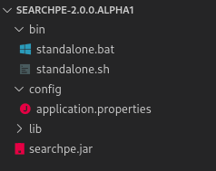
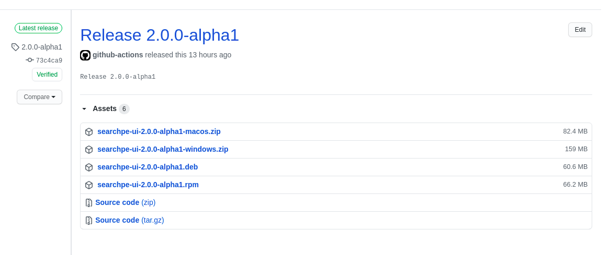

Si quieres instalar **Searchpe** en el sistema operativo de tu computador sigue los siguientes pasos:

## Instala PostgreSQL

Puedes usar https://www.postgresql.org/download/ para descargar e instalar PosgreSQL; sin embargo, puedes utilizar el método de tu preferencia.

Una vez instalado PostgreSQL necesitas crear:

- Una base de datos.
- Un usuario y contraseña que tenga acceso a la base de datos.

Puedes utilizar [PgAdmin](https://www.pgadmin.org/download/) para configurar tu base de datos.

## Instala Elasticsearch

Elasticsearch puede ser instalado con en método de tu preferencia; aquí tienes algunas alternativas disponibles:

- Si usas Windows puedes descargar el [MSI](https://www.elastic.co/guide/en/elasticsearch/reference/current/windows.html#download-msi) e instalarlo.
- Si usas CentOS, RHEL, o Fedora entonces puedes descargar e instalar [RPM](https://www.elastic.co/guide/en/elasticsearch/reference/current/rpm.html).

Para ver todas las opciones disponibles para instalar Elasticseach visita la documentación oficial [Install Elasticsearch](https://www.elastic.co/guide/en/elasticsearch/reference/current/install-elasticsearch.html)

## Instala Searchpe

- Descarga **Searchpe** desde [Searchpe Releases](https://github.com/project-openubl/searchpe/releases).



- Descomprime el `.zip` descargado:



- Abre el archivo `config/application.properties` y configura las conexiones a la base de datos y Elasticsearch:

```yaml
# PostgreSQL settings
quarkus.datasource.username=db_username
quarkus.datasource.password=db_password
quarkus.datasource.jdbc.url=jdbc:postgresql://localhost:5432/searchpe_db

# Elasticsearch settings
quarkus.hibernate-search-orm.elasticsearch.username=es_username
quarkus.hibernate-search-orm.elasticsearch.password=es_password
quarkus.hibernate-search-orm.elasticsearch.hosts=localhost:9200
quarkus.hibernate-search-orm.elasticsearch.protocol=HTTP
quarkus.hibernate-search-orm.elasticsearch.version=7
```

Reemplaza `db_username`, `db_password`, y `searchpe_db` con los datos de la base de datos que creaste.

- Inicia el servidor ejecutando el archivo `bin/standalone.bat`.

## Instala Searchpe UI

Descarga e instala **Searchpe UI** desde [Searchpe UI Releases](https://github.com/project-openubl/searchpe-ui/releases) y selecciona el archivo correcto dependiendo de tus sistema operativo.



Eso es todo, tendrás Searchpe funcionando en tu computador.
